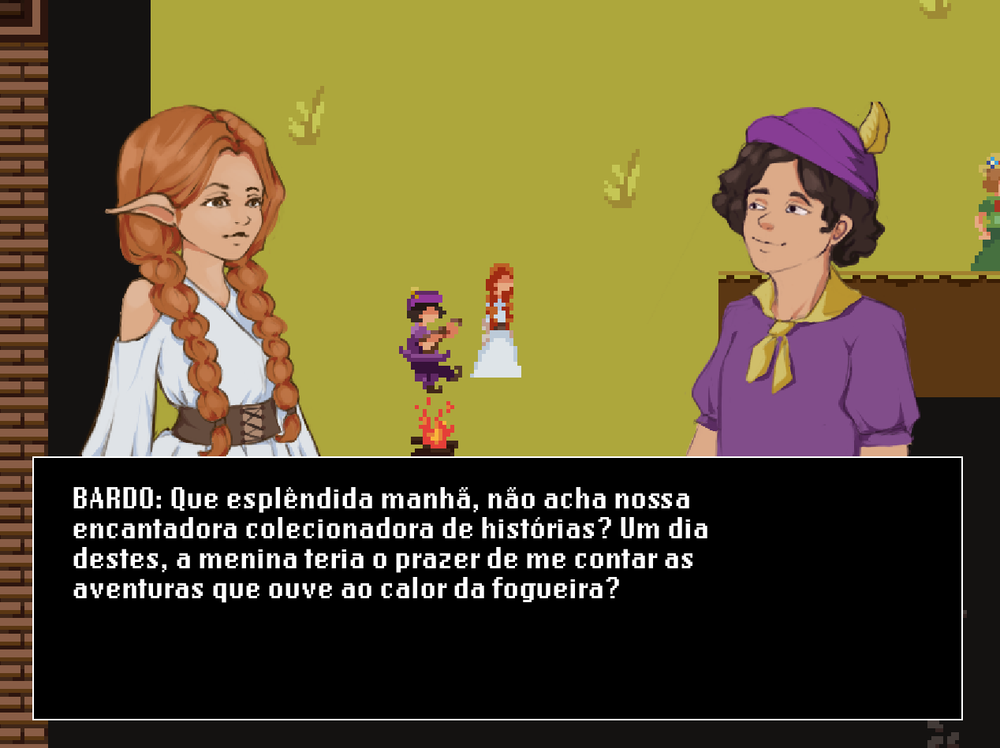

# 🕵️‍♂️🔍 Hidden Mystery

## 🔑 Description

**Hidden Mystery** is a Visual Novel and Murder Mystery game developed during the Random Game Jam 2023, organized by the NCGM group at FEUP. In this game, you take on the role of an investigator determined to uncover the perpetrator of a heinous crime that has shaken a small medieval village. 🏰🗡️

## 🌿 Context

The theme of the Game Jam was "Small World," which inspired us to create a rich and immersive environment filled with intriguing characters and dark secrets. In **Hidden Mystery**, you will explore the village, interact with local residents, and gather clues to solve the mystery behind the crime. 🕵️‍♀️🌌

## 🏰 Features

- **Immersive Narrative**: The story captivates players with engaging dialogues and unexpected twists. 📖✨
- **Medieval Setting**: Discover the charms and dangers of a medieval village, filled with details that bring the era to life. 🌿
- **Diverse Characters**: Meet a variety of villagers, each with their own stories and motivations, who will help or hinder your investigation. 🔮
- **Impactful Choices**: Your decisions will influence the course of the story and the game's outcome. ⚖️

## 🌍🗣️ How to Play

1. **Start the Game**: Download and install the game on your computer. 💻⬇️
2. **Explore**: Navigate the village and talk to characters to uncover clues. 🗣️
3. **Solve the Mystery**: Use the information you gather to deduce who the culprit is. 🕵️‍♂️❓

## 💻 System Requirements

- **OS**: Windows, macOS, or Linux 
- **Processor**: Intel Core i3 or equivalent 
- **Memory**: 4 GB RAM 
- **Graphics**: Graphics card with OpenGL support 
- **Storage**: 500 MB of available space 

## 🎉🙌 Acknowledgments

We would like to thank everyone who participated in the Game Jam and the NCGM group at FEUP for organizing this inspiring event. We hope you enjoy **Hidden Mystery** as much as we enjoyed developing it! 

## 🎮 GamePlay

  

**Have fun unraveling the mystery!** 🕵️‍♀️🔑🧩
